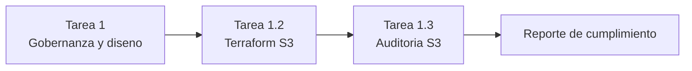

# Prueba Tecnica Cloud Engineer

## Introduccion
Esta prueba evalua la capacidad para disenar, implementar y auditar controles de gobernanza en nube. El escenario considera una aplicacion web global que gestiona PII y consume un modelo de IA via API, con enfoque multi-nube (AWS y GCP) y ejecucion practica en AWS.

## Entregables
- Tarea 1: Documento de estrategia de gobernanza y diseno.
- Tarea 1.2: IaC en Terraform para un bucket S3 seguro.
- Tarea 1.3: Script en Python (Boto3) para auditoria de gobernanza en S3.

## Estructura
- Tarea_1/
- Tarea_1.2/
- Tarea_1.3/

## Diagrama

## Detalle por carpeta
- Tarea_1: `Estrategia_Gobernanza_&_Diseño.md`
- Tarea_1.2: `README.md`, `terraform/`, evidencias en imagenes
- Tarea_1.3: `Audit.py`, `README.md`

## Nota
Se utilizo IA para la creacion de los README.md y para entender conceptos de Terraform y Python que desconociamos.
