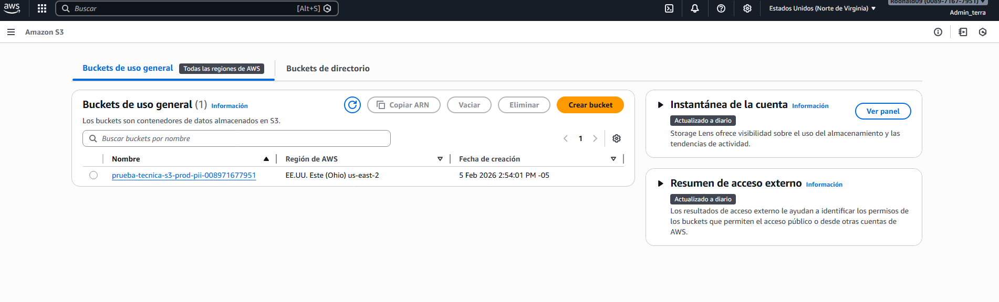
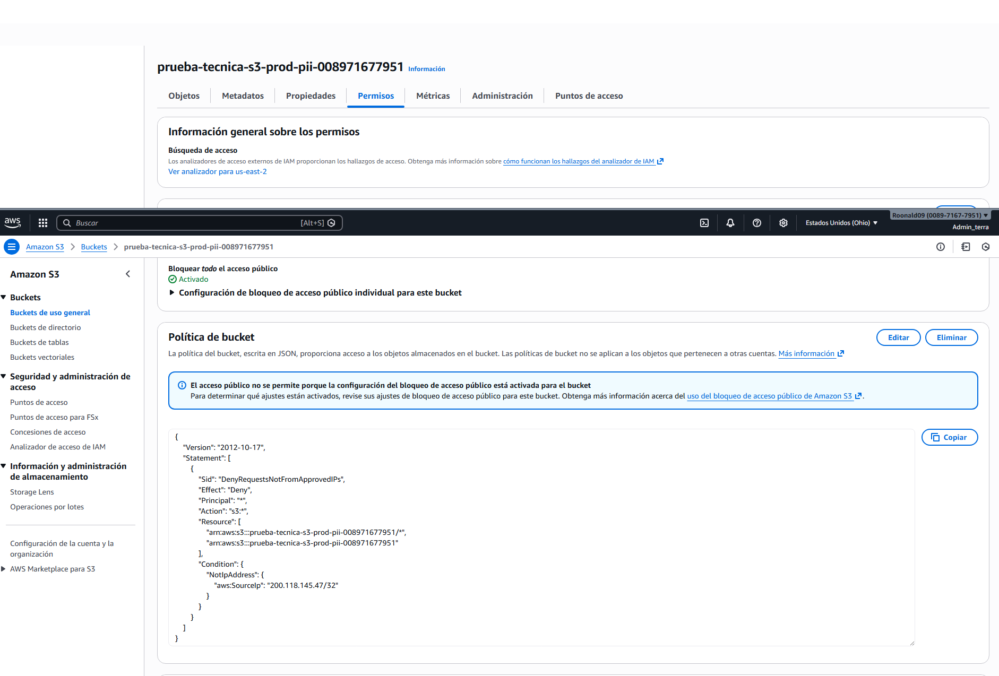

# Tarea 2 - Terraform (AWS S3)

## Descripcion
Se provisiona un bucket S3 privado con buenas practicas de gobernanza:
- Encriptacion en reposo (SSE-S3)
- Versionamiento habilitado
- Bloqueo de acceso publico
- Etiquetas de gobierno
- Politica opcional por IP permitida
- Regla de lifecycle para versionamientos no actuales

## Archivos
- terraform/main.tf
- terraform/variables.tf
- terraform/versions.tf
- terraform/outputs.tf
- terraform/terraform.tfvars

## Como ejecutarlo
1. Ubicarse en la carpeta `Tarea_2/terraform`.
2. Ejecutar:
   - `terraform init`
   - `terraform plan`
   - `terraform apply`

## Evidencia
S3 creado en AWS:

Politicas del S3:

